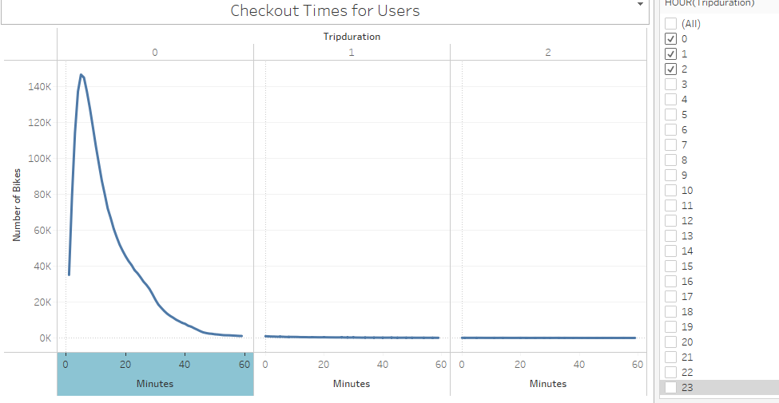
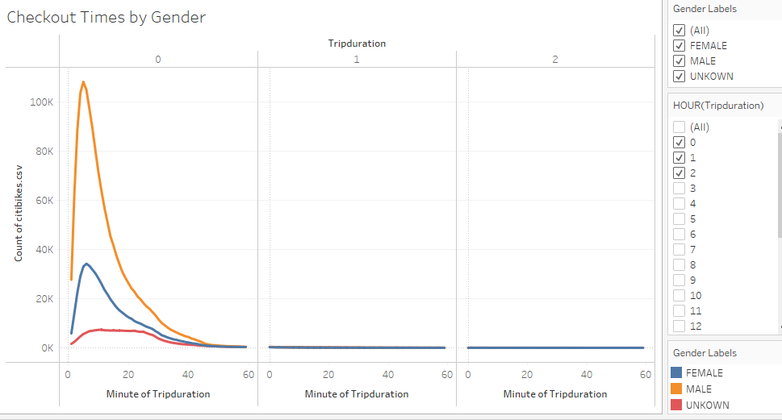
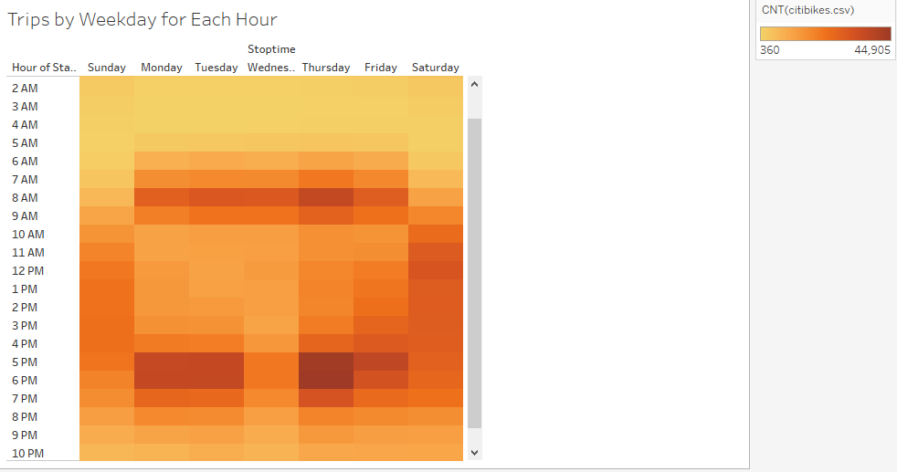
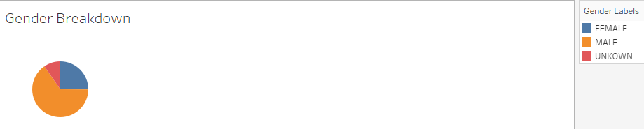
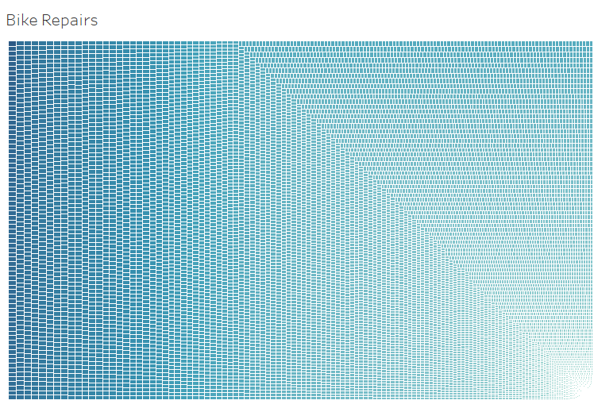

# bikesharing

[link to dashboard](LINK GOES HERE)

## Overview of the statistical analysis:

  The purpose of the analysis was to determine different data about New York's Citi Bikes usage including checkout times for users, checkout times by gender, which hours during the day were most prominent for bike usage, which hours during the day were most prominent by gender, customer vs subscriber usage on different days of the week, count of users per gender, and bike utilization by ID to determine which bikes are in need of repair.

## Results:

* Checkout Times for Users:

  Trip duration for the bulk of users, over 140,000, lasted about 10 minutes. The number of bikes being riden decreased after 10 minutes of usage, lowering steadily down to ~40,000 users at 20 minutes. Trip duration dropped to 20,000 bikes at 30 minutes andthe curve had completely flattened at the end of the hour, indicating almost no users were using the bikes for a complete hour.
  
* Checkout Times by Gender:

  Most of the users who checked out bikes were male, followed by female users, and then unknown users.
  
* Trips by Weekday for Each Hour:

  Most users used the bikes during the hours of 8 am, 5 pm, and 6 pm on Monday through Friday. Bikes were most infrequently used between the hours of 11 pm and 4 am throughout the week. On Saturdays, the bikes were most prominently used at 11 am and 12 pm, but overall usage was pretty consistent between 10 am and 8 pm, as opposed to during Monday through Friday when usage tends to occur mainly during rush hours. Sunday was the day of the week which saw the lowest bike usage. Peak bike usage on Sundays occured between 12:30 pm and 5:30 pm.  
  
 * Trips by Gender (Weekday per Hour):
  
  )

Males used the bikes more than the females, who used them more than the unknown riders. The times that genders used the bikes followed the patterns discussed when looking at the results for the Trips by Weekday for Each Hour, regardless of gender differences between male and female. 

* User Trips by Gender by Weekday:
  
  
  
  Subscribers tended to use the Citi Bikes more than customers. There was almost no differences found between male, female, and unknown gender customer usage. For subscriber usage, males used the bikes more than females who used them more than unknown genders. The day of the week that male and female subscribers used the bikes the most frequently was Thursday. Usage for male and female subscribers had the highest prminence on Mondays, Tuesdays, Wednesdays and Thursdays. 

* Gender Breakdown

  
  
  1,530,272 males used the Citi Bikes, 588,431 females used the Citi Bikes, 225,521 users of unknown gender used the Citi Bikes. Male usage was the most prominent overall, followed by female usage. 

* Bike Repairs

## Summary:
  
  After conducting this analysis, it was determined that males ride the citi bikes more often than other genders. Additionally, citi bike usage is most prominent during rush hour in the morning and evenings, and less popular on weekends. The largest number of users will only use the bikes for 10 minutes, so duration of bike usage is very short overall.
  An additional visualization for future analysis could analyze prominence of different genders at different starting stations. Similarly, another additional visualization could determine the prominence of different genders at different ending stations. 
